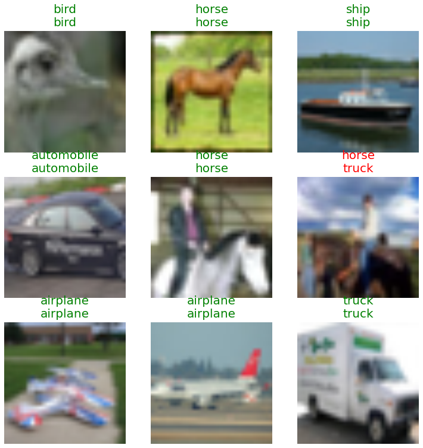
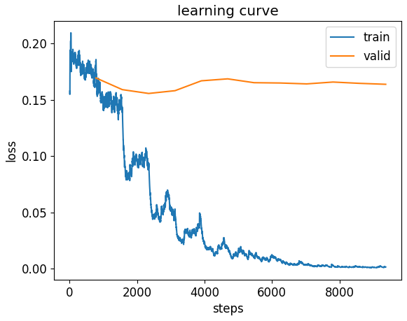
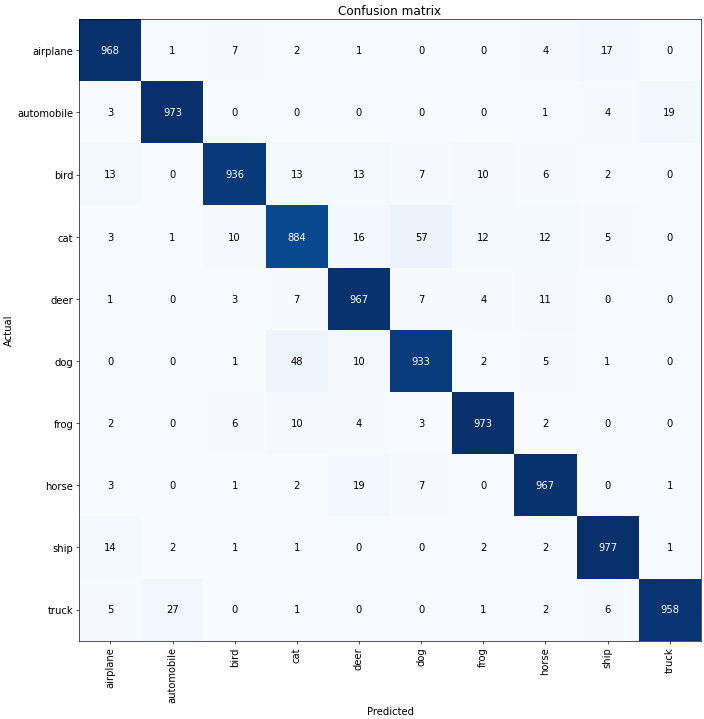

# A-Project 5: CIFAR-10 Image Classification & Overfitting Analysis (ResNet-34 + fastai)

This project explored **overtraining/overfitting** in deep learning using the **CIFAR-10** dataset and a **ResNet-34** model trained with **fastai**.  
By intentionally causing overtraining and then applying prevention techniques, the project demonstrates how training dynamics affect generalization.

* **Dataset:** CIFAR-10 (60,000 images, 10 classes)  
* **Tools:** Python, fastai, PyTorch, torchvision  
* **Techniques:** Transfer learning, fine-tuning, LR finder, early stopping, data augmentation  
* **Goal:** Identify overfitting and apply methods to improve generalization.

  
  
<em>Training vs. validation loss curve showing early signs of overfitting.</em>

---

### ⚙️ Model Setup & Training Procedure

1. Loaded CIFAR-10 and created a **fastai Learner** with a **pretrained ResNet-34**.  
2. Tracked **error rate** and trained for **2 epochs**, achieving strong initial performance.  
3. Examined predictions → most predictions matched ground truth correctly.  
4. Viewed **activation outputs** (10-dim probability vectors).  
5. Experimented with different learning rates:
   - **Too high LR (0.1)** → training loss spiked to **2.73**, showing unstable learning.  
   - Used **LR Finder** → optimal LR ≈ **4.7e-4**.  
6. Trained randomly initialized layers for **3 epochs** using `fit_one_cycle`.  
7. Fine-tuned entire model for **6–12 more epochs** with LR range **1e-5 to 1e-4**.

  
  
<em>Training vs. validation loss curve showing early signs of overfitting.</em>

---

### 📉 Detecting Overfitting

According to training logs :contentReference[oaicite:1]{index=1}:

- With frozen layers → validation loss dropped from **0.37 → 0.18**, error rate from **8.9% → 6.4%**.  
- After unfreezing → training & validation loss continued improving until **epoch 8**.  
- Beyond epoch 8 →  
  - Validation loss began to **fluctuate**  
  - Error rate slightly **increased**  
  - Training loss kept decreasing → **clear overtraining**  

💡 **Conclusion:** The model reached optimal performance at **epoch 8**. Training past that point caused mild overfitting.

---

### 🛠️ Methods to Prevent Overtraining

From the assignment discussion :contentReference[oaicite:2]{index=2}, the following techniques helped reduce overfitting:

#### ✔ Early Stopping  
Stops training when validation loss stops improving — prevents memorization of training data.

#### ✔ Data Augmentation  
Transforms such as:
- Rotate  
- Crop  
- Flip  
- Color jitter  
Increase data diversity → improves generalization.

#### ✔ L2 Weight Regularization (Weight Decay)  
Encourages smaller weights → reduces model complexity → prevents overfitting.

---

### 🧪 Class-wise Performance (Confusion Matrix)

The CIFAR-10 confusion matrix showed:  
**Best-performing classes**
- 🛳️ Ship — **977/1000 correct**  
- 🚗 Automobile — **973/1000 correct**  
- 🐸 Frog — **973/1000 correct**

**Worst-performing classes**
- 🐱 Cat — **884/1000**  
- 🚚 Truck — **858/1000**  
- 🐶 Dog — **933/1000**

  
  
<em>Confusion matrix showing class-wise model accuracy.</em>

🔍 **Why these classes struggled:**  
They are visually similar to other classes:
- Cats ↔ Dogs  
- Trucks ↔ Automobiles  

### 🔧 Recommendation for Improvement
- Apply **stronger augmentation** specifically for similar classes  
- Use **deeper models** (ResNet-50, EfficientNet) for better feature extraction  
- Use **class-specific fine-tuning** or **ensemble models** to separate difficult class pairs

---

### 🧠 Skills Demonstrated
- Transfer learning with PyTorch + fastai  
- Training dynamics analysis  
- Detecting overtraining using loss & error rate  
- Using LR finder and one-cycle policy  
- Confusion matrix evaluation  
- Applying regularization and augmentation

